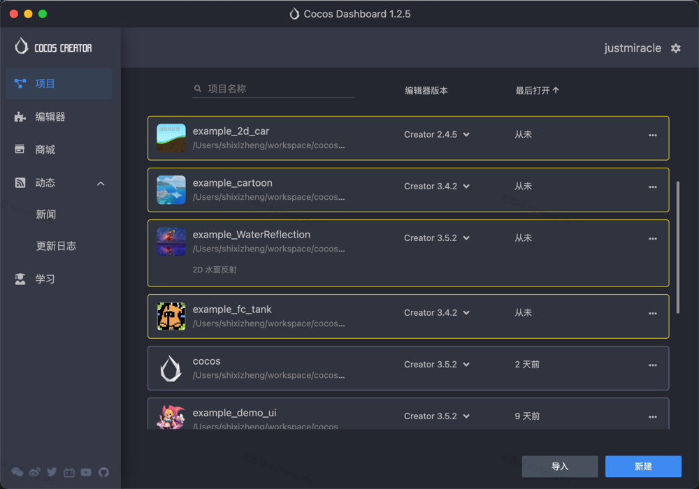
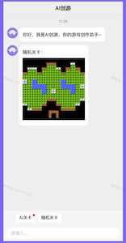

# AIGG
基于对话的AI智能工作站

# 项目文件目录介绍
|  文件目录   | 项目  | 测试环境 |
|  ----  | ----  | ----  |
| cocos  | cocos游戏-坦克大战 | |
| web  | 网站-游戏生成&聊天 | [AIGA测试环境](http://192.168.0.234:8080/)（需内网vpn） |

# cocos 游戏
## 1. 简介
游戏内容是经典游戏坦克大战
使用[cocos creator](https://www.cocos.com/creator)制作
## 2. 研发
使用cocos creator编辑器导入cocos目录即可


# web 前端
## 1. 简介


web端使用React框架研发
主体是React前端网页，集成了cocos creator导出的h5格式的游戏 和 其他模块
前后端使用 http api 的形式传递数据
## 2. 研发
### 2.1 安装node环境
请安装node，版本 v16.19.0
推荐使用[nvm](https://github.com/nvm-sh/nvm#installing-and-updating)安装
### 2.2 安装依赖
```bash
# 安装yarn
npm install --global yarn
# 进入web目录
cd web
# 安装依赖
yarn
```
### 2.3 启动服务
```bash
# 启动命令
yarn start
```
## 3. 前后端接口介绍
```javascript
// 测试环境API(公网) http://123.60.151.211:17008/message/send
POST /message/send

Request Body {
  "chat_id": "bba972a7-4f5e-4980-9c44-0592ec0e5e0e",
  "chat_name": "user",
  "prompt": "介绍下坦克大战"
}
// prompt 是前端对话框的输入内容

Respose Body {
  "id": "",
  "chat_id": "bba972a7-4f5e-4980-9c44-0592ec0e5e0e",
  "type": "",
  "chat_type": "",
  "title": "user",
  "content": "坦克大战游戏中通常包含以下元素：\n\n1. 坦克：玩家控制的主要角色，可以发射子弹攻击其他坦克和砖墙。\n\n2. 子弹：坦克发射的攻击武器，可以摧毁砖墙和敌方坦克。\n\n3. 砖墙：可以被摧毁的障碍物，坦克和子弹都可以摧毁它。\n\n4. 钢板：不能被摧毁的障碍物，坦克和子弹都不能摧毁它。\n\n5. 森林：可以为坦克提供遮蔽和保护，但子弹仍然可以穿过。\n\n6. 海水：可以阻止坦克通过，有些地图中也会设置桥梁来连接两岸。\n\n7. 基地：每个玩家的出生点和目标，当有一个玩家的基地被摧毁时，该玩家失败。\n\n8. 道具：可以增强或削弱坦克的属性，例如增加子弹威力、加速坦克移动等。\n\n这些元素的组合形成了坦克大战游戏中的地图和玩法。",
  "principal": "",
  "participator": null
}
// content 是后端返回的回答，会显示在对话框中
```